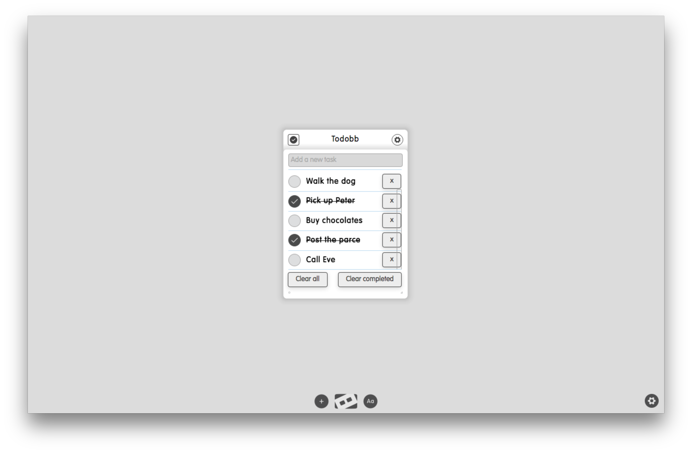

# To Do

## Screenshots

## Description

Build a to-do dizmo using the Backbone.js library. Read the full tutorial on our [blog](https://www.dizmo.com/how-to-write-a-to-do-dizmo-with-backbone-js/).

## What is new in V0.1

* Dizmo tutorial with Backbone.js.

## Additional Information

Developer: dizmo AG 
Contact: support@dizmo.com 
Website: [www.dizmo.com](https://www.dizmo.com) 
